# MiniCTF_2023

## Overview

| Title 	| Category  	| Flag 	|
|-------	|-----------	|------	|
| [Comment](#Comment)  	| Forensics 	| `miniCTF{ch3ck_c0mm3nt}`   	|
| [Notepad](#Notepad)  	| Forensics 	| `miniCTF{f1nd_m3_1n_th3_ch405}`   	|
| [Redacted](#Redacted)  	| Forensics 	| `miniCTF{r3d4ct3d_m3ss4g3_15nt_h4rd_r1ght}`   	|
| [What's_wrong_with_the_picture](#Whats_wrong_with_the_picture)  	| Forensics 	| `miniCTF{nemu_nemu_nyanko}`   	|
| [8bitsound](#8bitsound)  	| Forensics 	| `miniCTF{sp3ctrogr4m_c0lorfu1}`   	|
| [Tired_Cat](#Tired_Cat)  	| Forensics 	| `miniCTF{1m_s0_m0th3r_f^ck1n9_7ir3d_4ll_7h3_7im3}`   	|
| [Sharp_eyes](#Sharp_eyes)  	| Forensics 	| `miniCTF{1_w3nt_crAaazy_0v3r_U}`   	|
| [Ping](#Ping)  	| Misc      	| `miniCTF{64.227.14.145}`   	|
| [NASA](#NASA)  	| Misc      	| `miniCTF{today@nasa.gov}`   	|
| [Caesar_Cipher](#Caesar_Cipher)  	| Warm-up   	| `miniCTF{N0w_U_Kn0w_HoW_t0_3ncrYpt_Ur_M3s54g3}`   	|
| [Binary](#Binary)  	| Warm-up   	| `miniCTF{congratulations}`   	|
| [Base64](#Base64)  	| Warm-up   	| `miniCTF{b4s364_3ncrypt3d_by_ckjd0k}`   	|
| [INT](#INT)  	| Warm-up   	| `miniCTF{5urpr1se_y0u_4re_4maz1n9!!!}`   	|
| [FileFolder](#FileFolder)  	| Warm-up   	| `miniCTF{f0ld3r_w4s_hjdd3n_6y_ckjd0k}`   	|
| [Carry_Number](#Carry_Number)  	| Crypto    	| `miniCTF{B1n4ry_4ga1n_R19ht?}`   	|
| [7_Segment](#7_Segment)  	| Crypto    	| `miniCTF{7-segment_display_is_fun}`   	|
| [No_More_Than_10](#No_More_Than_10)  	| Crypto    	| `miniCTF{C4n_Y0u_Wr1t3_My_C0rr3ct_M3ss493?}`   	|
| [Navy_Signal_Code](#Navy_Signal_Code)  	| Crypto    	| `miniCTF{Y0U_KN0W_N4VY_C0D3?}`   	|
| [Caesar_Cipher_2](#Caesar_Cipher_2)  	| Crypto    	| `miniCTF{C43SAR_C1F3R_BUT_MY_ALF4B3T}`   	|
| [ROT](#ROT)  	| Crypto    	| `miniCTF{R0t10_r3p3aT_10_1im3s}`   	|
| [Char](#Char)  	| Crypto    	| `miniCTF{I_kn0w_u_kn0w_4sc11_t4b1e}`   	|
| [Fake_Flag](#Fake_Flag)  	| Crypto    	| `miniCTF{tH3_S3cr3t_hA$_8n_S0lv3d}`   	|
| [Equations](#Equations)  	| Crypto    	| `miniCTF{tk3_s3cr3t_numb3r_js_911429}`   	|
| [Header_File](#Header_File)  	| RE        	| `miniCTF{N0w_U_Kn0w_H0w_T0_Wr1t3_Ur_0wn_L1Br4ry}`   	|
| [Sort](#Sort)  	| RE        	| `miniCTF{R3_i5_v3ry_e4sy_h3h3h3_g00d_luck}`   	|
| [XOR](#XOR)  	| RE        	| `miniCTF{4re_y0u_re4dy_t0_r3v3rs3_?}`   	|
| [Epmuoihai](#Epmuoihai)  	| Web       	| `miniCTF{EHE_TE_NANDAYO_?}`   	|
| [Dry_cookie](#Dry_cookie)  	| Web       	| `miniCTF{C00k1e_i5_s0_w3t}`   	|
| [Flappy_Flag](#Flappy_Flag)  	| Web       	| `miniCTF{1f_u_4r3_4_pr0_pl4y3r_u_c4n_get_th1s_by_IDOR}`   	|

## Forensics

### Comment

#### Solution

- Ta nhận được 1 bức ảnh. Dựa vào đề bài, flag ta cần tìm sẽ nằm tại phần comment của bức ảnh.


**Flag**: `miniCTF{ch3ck_c0mm3nt}`.

### Notepad

#### Solution

- Ta nhận được 1 bức ảnh. Dựa vào tên đề bài, ta sẽ mở Notepad để tìm flag. Flag sẽ nằm ở cuối file.


**Flag**: `miniCTF{f1nd_m3_1n_th3_ch405}`.

### Redacted

#### Solution

- Ta nhận được 1 file word có nội dung bị bôi đen.


- Ta chỉ cần copy những phần bôi đen đó, ghép chúng lại và ta sẽ ra được flag.
    - Phần 1: miniCTF{
    - Phần 2: r3d4ct3d_
    - Phần 3: m3ss4g3
    - Phần 4: 15nt_h4rd_
    - Phần 5: r1ght}

**Flag**: `miniCTF{r3d4ct3d_m3ss4g3_15nt_h4rd_r1ght}`.

### What's_wrong_with_the_picture

#### Solution

- Ta nhận được 1 bức ảnh, nhưng khi mở ra thì bị báo lỗi “It looks like we don’t support this file format”.


- Ta sẽ dùng HxD để sửa file signature của bức ảnh. File signature là dữ liệu để nhận diện hoặc xác minh nội dung bên trong file đó và thường được viết dưới dạng hex.


- Ở đây, ta có file đuôi .jpg, nên ta sẽ cần chỉnh sửa lại file signature của nó sao cho phần Decoded text (chính là nội dung ta đọc được nếu mở bằng Notepad) xuất hiện JFIF, tức định dạng file của bức ảnh. Ta sẽ sửa FF D7 FF E1 00 10 4B 46 49 47 sang FF D8 FF E0 00 10 4A 46 49 46 00 01:


- Lưu lại và mở lại bức ảnh, ta sẽ thu được flag.


**Flag**: `miniCTF{nemu_nemu_nyanko}`

### 8bitsound

#### Solution

- Ta nhận được 1 file âm thanh. Ta sẽ mở nó bằng Audacity, một phần mềm dùng để chỉnh sửa âm thanh.


- Ta sẽ chuyển từ dạng Waveform sang dạng Spectrogram.


- Spectrogram là một cách biểu diễn trực quan các tần số của một tín hiệu nhất định với thời gian. Và ta sẽ nhận được flag.


**Flag**: `miniCTF{sp3ctrogr4m_c0lorfu1}`.

### Tired_Cat 

#### Solution

Đề bài cho một bức ảnh.
- Ta tải ảnh về và mở ảnh bằng bằng Notepad, lướt đến cuối ta thấy có một link:


- Search link ta thấy link là một tool để giải challange: image/image Steganography

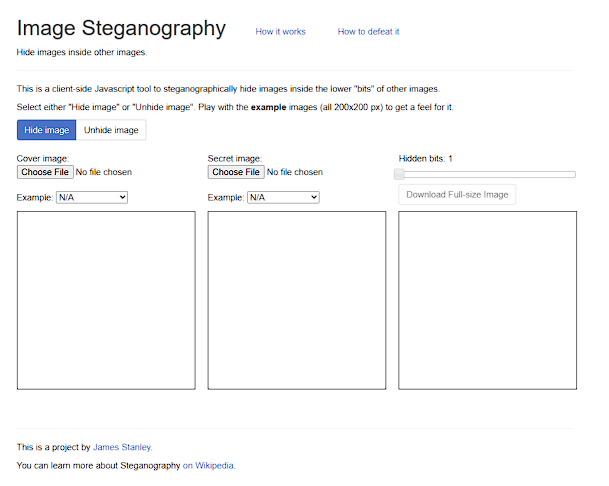

- Vào phần Unhide image/image để giải mã


**Flag**: `miniCTF{1m_s0_m0th3r_f^ck1n9_7ir3d_4ll_7h3_7im3}`.

### Sharp eyes

#### Solution

- Để bài có nói đến sự tinh mắt + xem video ta thấy có nhiều phần của
flag trong đó.
- Có nhiều cách để làm bài này:
    - Chỉnh tốc độ video xuống để nhìn từng ảnh, tuy nhiên cách này hơi mệt vì phải tìm đúng ánh chứa flag, nếu không cẩn thận có thể nhầm lẫn do flag có cả chữ hoa chữ thường.
    - Sử dụng các tool để cắt ảnh từ video. Ở đây ta dùng tool:
https://ezgif.com/video-to-jpg


- Ghép các chữ cái với nhau ta được flag.

**Flag**: `miniCTF{1_w3nt_crAaazy_0v3r_U}`.

### Encyclopedia

- Ta để ý một số chi tiết từ đề bài:
    - Wikipedia bản Eng.
    - IP: 42.113.170.207 . Chú ý đây là IP người dùng chứ không phải
    IP của trang web nào đó.
    - Thêm thông tin lên Wiki.
- Tìm hiểu cách thêm thông tin trên wiki ta nhận được hướng dẫn đó là:
Nhấn vào dấu ba chấm ở góc màn hình bên phải, chọn phần *contributions*


- Điền IP mà đề bài cấp rồi search


- Ta thấy có một số phần được sửa trong một bài viết. Để thấy phần đã sửa chọn vào *diff*

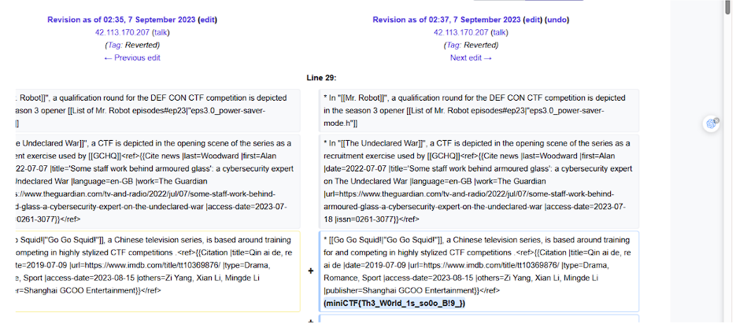

- Ta tìm được thông tin mà người dùng `42.113.170.207` đã sửa.

**Flag**: `miniCTF{Th3_W0rld_1s_so0o_B!9_}`.

## Misc

### Ping

#### Solution

- Đề bài yêu cầu tìm địa chỉ IP của trang web `minictf.infosecptit.club`. Ban đầu, khi
tên miền trang web vẫn còn, chúng ta chỉ cần sử dụng lệnh trong terminal của
máy tính có thể biết được địa chỉ IP của trang web.

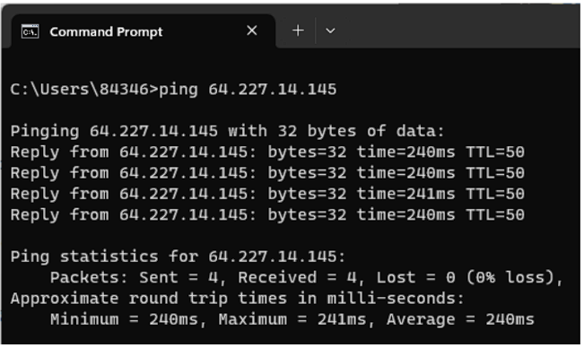

- Trong hình trên, tên miền không còn nên chúng ta phải ping thẳng đến IP của
trang web. Và IP này cũng chính là flag của challenge trên.

**Flag**: `miniCTF{64.227.14.145}`.

### NASA

#### Solution

- Từ đề bài ta chú ý đến những chi tiết sau:
    - Tổ chức NASA có trang web là nasa.gov
    - Tài khoản email vào ngày 11 tháng 7 năm 1997
    - Giáo sư Closeheimer, Kahle, Gilliat là ai? Giáo sư Closeheimer chắc là tên của nhân vật trong cốt truyện. Còn khi tôi search “Kahle và Gilliat” thì có một tin rất hữu ích:


- Vào wiki:

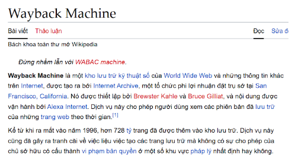

- Như vậy ta biết muốn tìm thông tin của web nasa.gov vào ngày 11 tháng 7 năm 1997 thì ta dùng 1 web khác đó là wayback machine. Vào trang web trên nhập URL mà đề bài đã cho:

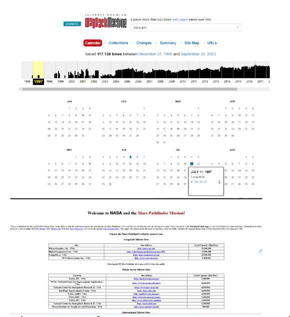

- Đến đây ta có thể tự dò email hoặc Ctrl + F kí tự @ để tìm email.

**Flag**: `miniCTF{today@nasa.gov}`.

## Warm-up

### Caesar_Cipher

#### Solution 

- Đề cho 1 file cipher.txt chứa đoạn văn bản trông khá giống dạng của flag:
`rnsnHYK{S0b_Z_Ps0b_MtB_y0_3shwDuy_Zw_R3x54l3}`
- Tên đề bài là Caesar Cipher cũng là tên của 1 phương thức mã hóa. Copy đoạn văn
bản đó rồi dán vào tool giải mã Caesar rồi ấn Decrypt ta thấy flag ngay kết quả đầu
tiên


**Flag**: `miniCTF{N0w_U_Kn0w_HoW_t0_3ncrYpt_Ur_M3s54g3}`.

### Binary

#### Solution

- Bài cho chúng ta 1 file binary.txt có nội dung như sau: 01100011 01101111 01101110 01100111 01110010 01100001 01110100 01110101 01101100 01100001 01110100 01101001 01101111 01101110 01110011
- Sử dụng tool chuyển đổi mã nhị phân sang kí tự ta được đoạn văn bản bên trong
flag.

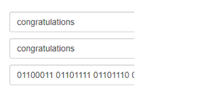

- Sau đó ghép với form flag miniCTF{} ta có flag của bài

**Flag**: `miniCTF{congratulations}`.

### Base64

#### Solution

- File output.txt: `bWluaUNURntiNHMzNjRfM25jcnlwdDNkX2J5X2NramQwa30=`

- Đề bài gợi ý là Base64 => dùng tool encode Base64 ra được flag:

**Flag**: `miniCTF{b4s364_3ncrypt3d_by_ckjd0k}`.

### INT

#### Solution

- Đề bài cho tải về 1 bức ảnh:


- Nhìn qua bức ảnh thì không thấy gì, tên file có vẻ có gì đó đặc biệt, thử tìm phương thức mã hóa tại [link](https://www.dcode.fr/cipher-identifier) (dcode.fr)


- Dùng thử các công cụ https://kt.gy/ thì may mắn ra được flag:

**Flag**: `miniCTF{5urpr1se_y0u_4re_4maz1n9!!!}`.

### FileFolder

#### Solution

- Đề bài cho một file `.rar`, tải về và giải nén thấy khá nhiều folder, lướt xem qua thì thấy có 1 vài folder chứa flag
- Thử sắp xếp lại các folder ở cột date modified:


- Ta nhận được đầu và cuối của flag là: miniCTF{XXXXXXXXX-6y_ckjd0k}
- Đoán được các folder nằm giữa có thể cũng được sửa đi như thế, tìm tương tự với các
folder Me_300, Me_39, Me_495, ....
- Trong folder Me_300 tìm thêm được đoạn: *hjdd3n_6y*
- Trong folder Me_39 tìm thêm được đoạn: *F{f0ld3r*
- Lướt qua các folder sau ta k thấy mảnh flag nào nên quyết định ghép flag rồi submit:
`miniCTF{f0ld3rhjdd3n_6y_ckjd0k}`.
- Flag bị sai, nghĩa là còn thiếu mảnh nào đó, nhìn các mảnh ta thấy được mảnh này nối
với mảnh kia qua 2 kí tự, thử find với 3r.


- Oh sai vài phút ngồi chơi thì ta tìm được mảnh còn sót lại của flag là 3r_w4s_hj

**Flag**: `miniCTF{f0ld3r_w4s_hjdd3n_6y_ckjd0k}`.

## Crypto

### Carry_Number

#### Solution

- Đề cung cấp 1 file txt chỉ chứa 2 số nguyên lớn và có 1 chút hint về việc tìm số nhớ
trong quá trình tính tổng 2 số đó. Theo cách tính tổng đã học từ tiểu học, 2 số có
tổng nhỏ hơn 10 sẽ nhớ 0, còn tổng lớn hơn 10 sẽ nhớ 1. Từ đó, ta nhận thấy số
nhớ ở hệ đếm nhị phân. Sau đó ta tính tổng từng chữ số theo đúng thứ tự đặt
tính là từ phải sang trái, do đó, chuỗi số nhị phân cũng sẽ lần lượt từ phải sang
trái. Sau khi tính tổng, ta nhận được chuỗi số nhớ theo đúng thứ tự đặt tính như
sau:

    01101101011010010110111001101001010000110101010001000110011110110
    10000100011000101101110001101000111001001111001010111110011010001
    10011101100001001100010110111001011111010100100011000100111001011
    01000011101000011111101111101

- Paste chuỗi số nhị phân này vào tool giải mã nhị phân ta nhận được flag:


**Flag**: `miniCTF{B1n4ry_4ga1n_R19ht?}`.

### 7_Segment

#### Solution

- Dựa vào đoạn mô tả ở đề bài, ta có thể đoán được flag có 33 ký tự, tương ứng với file được cấp có 33 dòng. Ngoài ra, gợi ý “giống đồng hồ ở đèn giao thông” và Hint miễn phí có đường link dẫn đến trang web của LED 7 đoạn cho thấy mỗi xâu ký tự mã hóa cho 1 số hoặc 1 chữ cái. Khi giải mã dòng đầu tiên, ta nhận được số 6 và chữ cái ‘d’. Lúc này ta đoán “6d” là số biểu diễn ở dạng hexa, giải mã ta được chữ ‘m’ cũng là chữ cái đầu tiên của flag. Ta giải mã tương tự theo cách này sẽ nhận được flag.

- Để giải mã, ta sử dụng tool dcode.fr và để chính xác, chúng ta cần xóa hết các ký tự
xuống dòng rồi decrypt sẽ ra đoạn mã hex

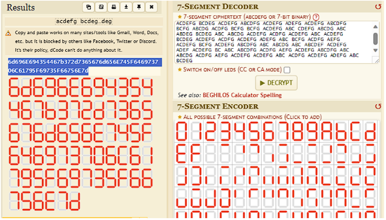

- Convert mã hex sang ascii ta được flag


**Flag**: `miniCTF{7-segment_display_is_fun}`.

### No_More_Than_10

#### Solution

- Trong phần mô tả của file được cung cấp, ta có thể đoán các ký tự lạ chính là ký tự
chữ số và ký tự đặc biệt. Có nghĩa là những ký tự cần được sửa trong đoạn ciphertext là các ký tự chữ cái. Nếu tách các ký tự chữ cái ra thì ta có đoạn văn bản như sau

- `ciniCTF-C-n-E-u-Wh-t--Me-C-rh-ct-C-ss-----`

- Tiếp tục đọc description, ta biết cách mã hóa của flag giống với ROT13 nhưng ở
đây, các ký tự của flag chỉ xoay vòng 10, tức là sau ký tự ‘j’ trong bảng chữ cái
tiếng Anh (là ký tự thứ 10), ký tự ‘k’ sẽ biến thành ký tự ‘a’, tương tự ký tự ‘u’ cũng
sẽ biến thành ký tự ‘a’ nhưng là xoay vòng lần thứ hai. Dựa vào mảng các số đã
cho ta biết được số lần xoay vòng của từng ký tự chữ cái, từ đó có thể giải mã
được chúng. Tôi có 1 đoạn code sau để giải mã theo ý tưởng trên

```cpp
#include<bits/stdc++.h>
using namespace std;

char alphabeta[30], alphabetA[30];
int idxa[30], idxA[30];
void ktao(){
    char ca = 'a', cA = 'A';
    int i;
    // gán bảng chữ cái viết hoa và viết thường
    for(i = 0; i < 26; i++){
        alphabeta[i] = ca++;
        alphabetA[i] = cA++;
    }
    i = 0;

    // gán vị trí của chữ cái trong bảng chữ cái
    for(char ia = 'a', iA = 'A'; ia <= 'z', iA <= 'Z'; ia++, iA++){
        idxa[ia] = i;
        idxA[iA] = i;
        i++;
    }
}

int main(){
    ktao();
    char mess[100] = "ciniCTF{C4n_E0u_Wh1t3_Me_C0rh3ct_C3ss493?}";
    int times[] = {1, 0, 0, 0, 0, 0, 0, 0, 0, 2, 0, 0, 1, 0, 0, 2, 0, 0, 1, 0, 0, 1, 0, 0};
    int j = 0;
    cout << "flag: ";
    for(int i = 0; i < strlen(mess); i++){
        if(mess[i] >= 'a' && mess[i] <= 'z'){
            mess[i] = alphabeta[idxa[mess[i]] + 10*times[j]];
            j++;
        }
        if(mess[i] >= 'A' && mess[i] <= 'Z'){
            mess[i] = alphabetA[idxA[mess[i]] + 10*times[j]];
            j++;
        }
    }
    cout << mess << endl;
    return 0;
}
```

- Sau khi chạy chương trình, ta nhận được flag

**Flag**: `miniCTF{C4n_Y0u_Wr1t3_My_C0rr3ct_M3ss493?}`.

### Navy_Signal_Code

#### Solution

- Khi mở file flag.png, ta nhận được 1 hình ảnh gồm các lá cờ, dấu “_” và dấu “{}”. Ta
đoán mỗi lá cờ đó mã hóa cho 1 ký tự của flag. Ngoài ra tiêu đề của bài này là Navy
signal code, ta search google có thể thấy được các ký tự mã hóa như thế nào

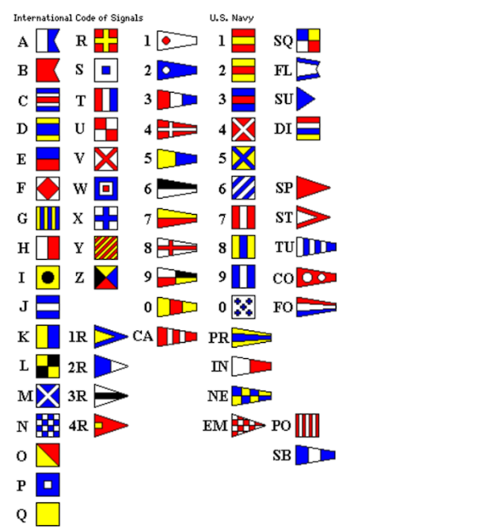

**Flag**: `miniCTF{Y0U_KN0W_N4VY_C0D3?}`.

### Caesar_Cipher_2

#### Solution

- Đây cũng là mật mã Caesar giống bài Caesar Cipher, tuy nhiên đối với bài Caesar
Cipher, xâu kí tự được dùng để mã hóa là 1 xâu tiêu chuẩn gồm 10 chữ số và 26 chữ
cái.

- Để giải mã được đoạn văn bản, cần chú ý xâu được cung cấp (đã bị lược bớt 1 vài
chữ số và chữ cái so với bảng ký tự tiêu chuẩn) và nội dung trong file cần tải về (key
= title tức là key = 10). Chúng ta dùng tool dcode.fr, paste đoạn văn bản và chọn tùy
chọn USE A CUSTOM ALPHABET và đặt key = 10 rồi ấn Decrypt sẽ ra flag của bài

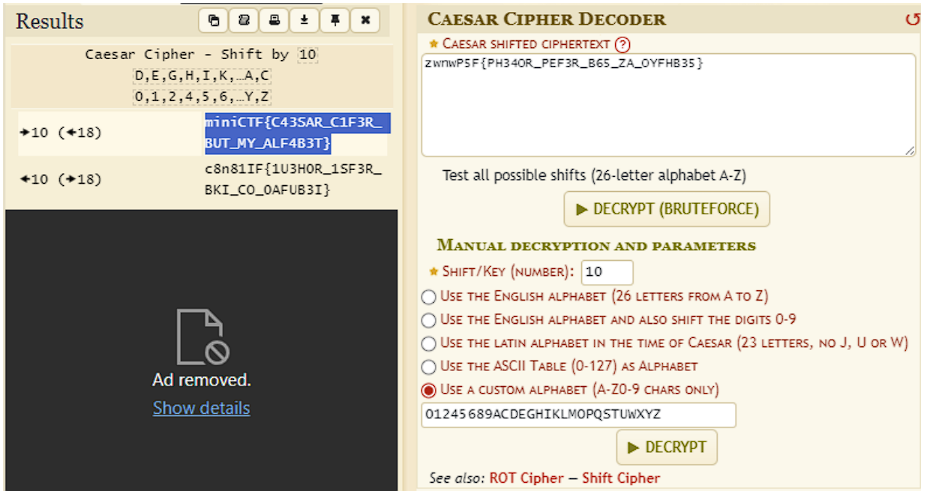

**Flag**: `miniCTF{C43SAR_C1F3R_BUT_MY_ALF4B3T}`.

### ROT

#### Solution

- Tải về, đọc file Decription.txt


- Đề bài là ROT, dùng tool giải tất cả các ROT => là ROT4


**Flag**: `miniCTF{R0t10_r3p3aT_10_1im3s}`.

### Char

#### Solution

- Lấy các giá trị trong bức ảnh ra: 109 105 110 105 67 84 70 { 73 _ 107 110 48 119 _ 117 _
107 110 48 119 _ 52 115 99 49 49 _ 116 52 98 49 101 }

- Quan sát các giá trị gần giống với mã Ascii, ta thử sử dụng Ascii table

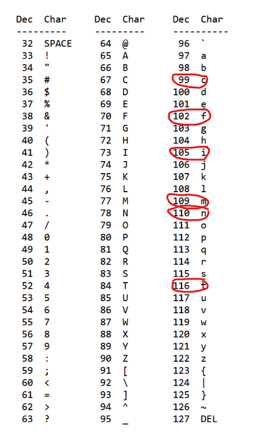

- Mã hóa 6 kí tự đầu ta thấy đúng hướng ra được form Flag là miniCTF

- Tiếp tục mã hóa theo bảng Ascii các kí tự còn lại ra được flag:

**Flag**: `miniCTF{I_kn0w_u_kn0w_4sc11_t4b1e}`.

### Fake_Flag

#### Solution

- Đọc file encode.c
    - Chuỗi flag[] bao gồm các kí tự flag cách nhau bởi một dấu cách
    - Biến len là chiều dài thực tế của flag thực.
    - Vòng For đưa ra một output.txt là mã hóa của từng kí tự trong chuỗi flag[]
- Phân tích phương pháp mã hóa (flag[i] - (secret * 4) / len)
    - Lấy từng kí tự trong chuỗi flag[] (theo giá trị bảng Ascii) trừ đi giá trị X với X = (secret * 4) / len
    - Nhận định số X là một số xác định, từ đây ta có 2 cách để tìm ngươci lại flag[i] từ file output.txt: brute-force giá trị của secret hoặc shift-cipher
- Brute-force
    - Ta có giá trị của biến len = 33, giá trị của flag[i] - (secret * 4) / len trong file output.txt
    - Nên ta có công thức tìm lại flag[i] = các giá trị trong file output + (secret * 4) / len
    - Với từng giá trị của biến secret ta có 1 giá trị của flag[i] => chuỗi flag

    

    - (Mảng output gồm các giá trị của flag[i] trong file output.txt)
    - Sau khi chạy ra được các giá trị có khả năng của chuỗi flag[] tìm đc flag là: `m i n i C T F { t H 3 _ S 3 c r 3 t _ h A $ _ 8 n _ S 0 l v 3 d }`

    - Thấy flag còn dấu cách, ta sửa code một chút để loại bỏ dấu cách để submit

    

    - Chạy xong được flag:
- Shift-cipher
    - Các giá trị của kí tự flag đều được giảm đi với giá trị là (secret * 4) / len => dùng công cụ shift-cipher tìm ra giá trị bị shift đi. ( m (= 109) – m’ (= 102) = 5)
    - Ta cộng các giá trị khác với 5 (trừ gí trị 25 tương ứng với dấu cách)
    - Chuyển đổi theo bảng Ascii ta được các giá trị của flag[i]

**Flag**: `miniCTF{tH3_S3cr3t_hA$_8n_S0lv3d}`.

### Equations

#### Solution

- Sau khi sub thử flag có trong file thấy sai => dự đoán flag còn bị thiếu một đoạn mã
số thay vào cụm ‘xxxxxx’
- Mảng num_flag[] chứa 3 số, có thể 1 trong 3 số là giá trị còn ẩn của flag
- Dựa vào đoạn mã hóa:
    - Với mỗi vòng lặp i:
        - Giá trị của y đều bằng 0
        - Vòng lặp j lặp lại 3 lần (là kích thước của num_flag[])
        - Mỗi lần j lặp lại thì giá trị x[j] nhận 1 giá trị khác nhau
        - Giá trị của y được tăng thêm 1 phần là x[j] * num_flag[j];
    - Có vẻ khó hiêu, ta thử biểu diễn dưới dạng toán học xem sao:

    

    

- Các giá trị được bôi đỏ nằm trong file ouput.txt, nhìn đã rất quen thuộc r, đây là giải hệ
phương trình 3 ẩn là 3 giá trị của num_flag[]
- Giải hệ phương trình được num_flag[] = {911429, 1234567, 7654321}, giá trị thiếu trong
flag tương ứng với 6 kí tự ‘x’

**Flag**: `miniCTF{tk3_s3cr3t_numb3r_js_911429}`.

## RE

### Header_File

#### Solution

- Sau khi tải các file đề bài cho, chạy file flag.c nhận được đoạn văn bản
`n0w_H0w_T0_Wr1t3_Ur_0wn_L1Br4ry}miniCTF{N0w_U_K`

- Nhưng dựa vào form flag ta thấy có vẻ flag đã bị thay đổi thứ tự. Đọc source của
file flag.c ta thấy hàm sub1(), sub2(), sub3() được gọi theo đúng thứ tự đó. Ta để ý
ở phần include có 3 thư viện “P1.h”, “P2.h” và “P3.h”. 3 file này gọi là header file,
khá giống với thư viện trong C.

- Khi đọc source của 3 file đó, ta đoán hàm sub3() trong file “P1.h” sẽ phải được gọi
trước, sau đó là đến hàm sub1() trong file “P2.h” và cuối cùng là hàm sub2() trong
file “P3.h”. Vì thế, để tìm được flag, ta chỉ cần gọi 3 hàm này theo đúng thứ tự
trên sẽ ra được flag của bài

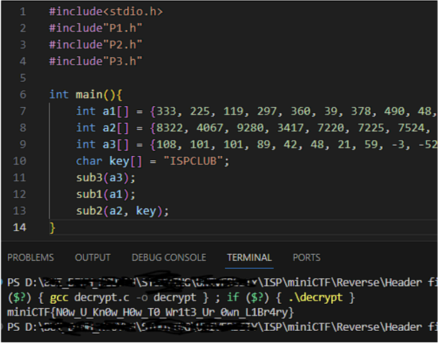

**Flag**: `miniCTF{N0w_U_Kn0w_H0w_T0_Wr1t3_Ur_0wn_L1Br4ry}`.

### Sort

#### Solution

- Sau khi đọc code, ta thấy flag có 32 ký tự và các ký tự của flag đã bị đảo thứ tự. Bây giờ ta chỉ cần sắp xếp lại các ký tự là tìm được flag:

```cpp
#include <stdio.h>
#include <string.h>
int main()
{
    char flag[32];
    flag[0] = 'R';
    flag[27] = '_';
    flag[4] = '5';
    flag[28] = 'l';
    flag[2] = '_';
    flag[29] = 'u';
    flag[3] = 'i';
    flag[17] = '3';
    flag[22] = '_';
    flag[1] = '3';
    flag[30] = 'c';
    flag[23] = 'g';
    flag[7] = '3';
    flag[10] = '_';
    flag[5] = '_';
    flag[9] = 'y';
    flag[11] = 'e';
    flag[15] = '_';
    flag[8] = 'r';
    flag[12] = '4';
    flag[14] = 'y';
    flag[6] = 'v';
    flag[18] = 'h';
    flag[13] = 's';
    flag[16] = 'h';
    flag[19] = '3';
    flag[24] = '0';
    flag[20] = 'h';
    flag[25] = '0';
    flag[21] = '3';
    flag[26] = 'd';
    flag[31] = 'k';
    for(int i = 0; i < 32; i++)
    {
        printf("%c", flag[i]);
    }
}
```

**Flag**: `miniCTF{R3_i5_v3ry_e4sy_h3h3h3_g00d_luck}`.

### XOR

#### Solution

- Đọc code ta thấy, hàm encrypt sau khi mã hóa flag sẽ ra các ký tự trong chuỗi encrypt. Bây giờ chỉ cần viết hàm để giải mã các ký tự đó. Chú ý: a^a=0.

```cpp
#include <bits/stdc++.h>
using namespace std;
string key = "ISPCLUB";
char encrypt_flag[36] = {36, 58, 62, 42, 15, 1, 4, 50, 103, 34, 38, 19, 44,
                        114, 60, 12, 34, 38, 120, 49, 59, 22, 39, 96, 28, 62, 
                        102, 52, 122, 33, 35, 112, 19, 106, 63};
string encrypt(string s)
{
    for (int i = 0; i < s.size(); i++)
    {
        s[i] ^= key[i % 7];
    }
    return s;
}
int main()
{
    cout << "-------------------WELCOME_TO_RE2-----------------------------\n";
    cout << "Input Flags: \n";
    string flag;
    cin >> flag;
    if (flag.size() == 35 && encrypt(flag) == encrypt_flag)
    {
        cout << "Here is your flag: " << flag;
    }
    else
        cout << "Incorect!!!";
}
```
**Flag**: `miniCTF{4re_y0u_re4dy_t0_r3v3rs3_?}`.

## Web

### Epmuoihai

#### Solution

- Đề bài cho ta một trang web cho phép đăng nhập:

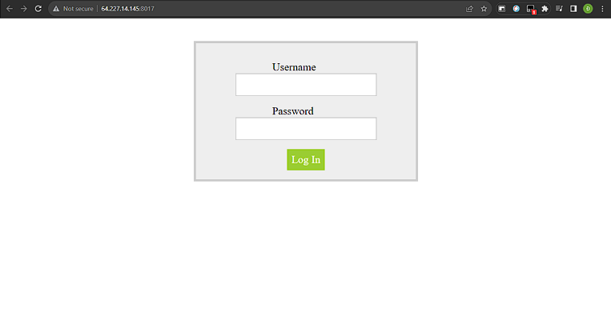

- Đề bài bảo ta F12 nên ta nhấn F12 để đọc source:

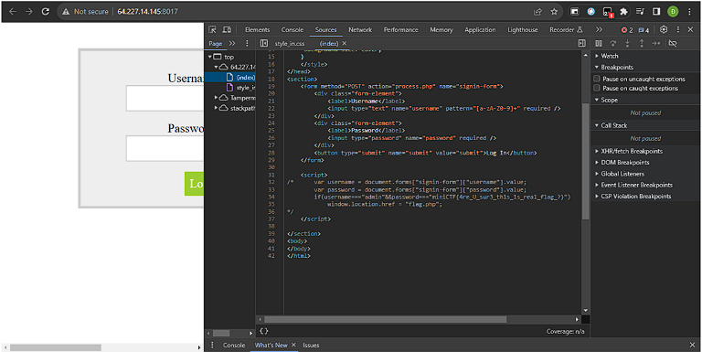

- Đọc source ta biết được nếu đăng nhập bằng admin và password là
miniCTF{4re_U_sur3_th1s_1s_real_flag_?} thì nhận được flag.

**Flag**: `miniCTF{EHE_TE_NANDAYO_?}`.

### Dry_cookie

#### Solution

- Đề bài cho ta một trang web bảo mình không phải admin:

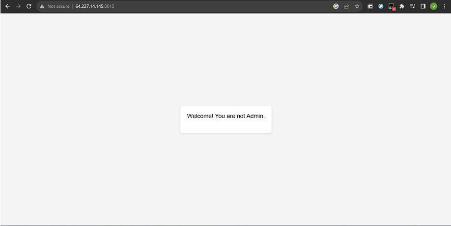

- Ta phải làm admin mới lấy được flag, có một cách xác minh admin đó là thông
qua cookie, nhấn F12, chọn Application, chọn Cookie. Có một cookie admin có
giá trị -1, chuyển nó thành 1, refresh lại trang để trở thành admin.


**Flag**: `miniCTF{C00k1e_i5_s0_w3t}`.

### Flappy_Flag

#### Solution

- Đề bài cho ta một trò chơi huyền thoại flappy bird.


- Với bài này có 3 cách làm:
    - Cách 1: Chơi đủ 15 điểm để ra flag.
    - Cách 2: Ở phần cookie sửa cookie session từ 15 xuống 1 để dễ chơi hơn.

    

    - Cách 3: Đọc kỹ ở source game.js ta thấy khi điểm bằng với giá trị cookie session thì in ra flag ở file 327a6c4304ad5938eaf0efb6cc3e53dc, mở file
    đó bằng cách thêm tên file vào URL. Khi đó, web sẽ tải về một file có tên
    như trên vì trình duyệt không hiển thị được file này, mở nó bằng notepad
    và lấy được flag.

    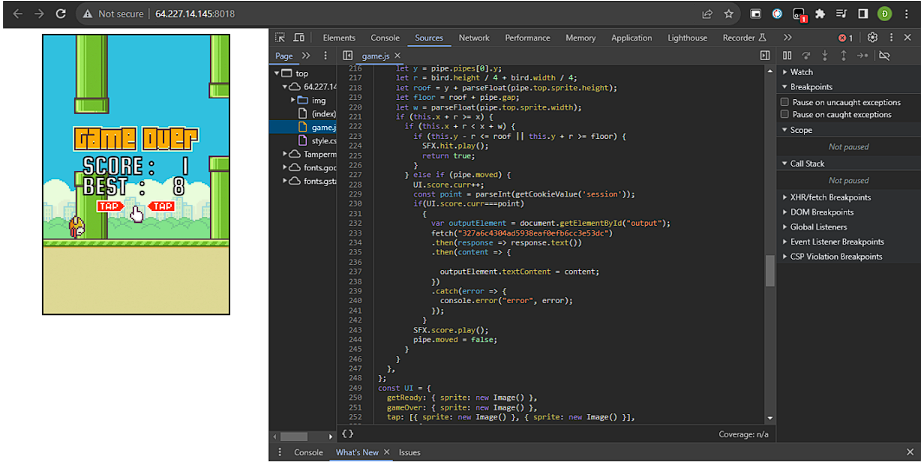

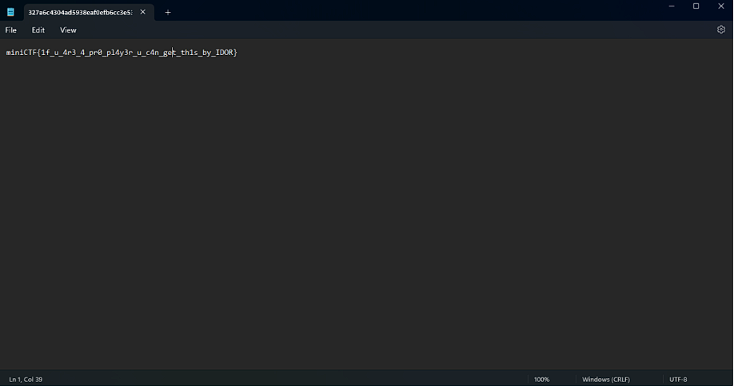

**Flag**: `miniCTF{1f_u_4r3_4_pr0_pl4y3r_u_c4n_get_th1s_by_IDOR}`.


